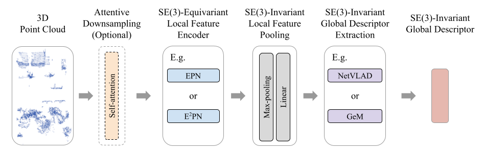
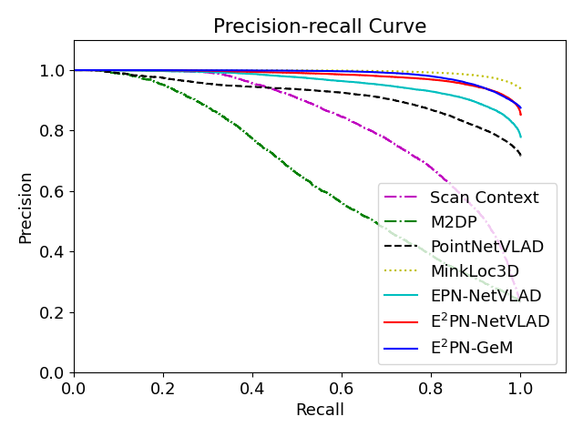
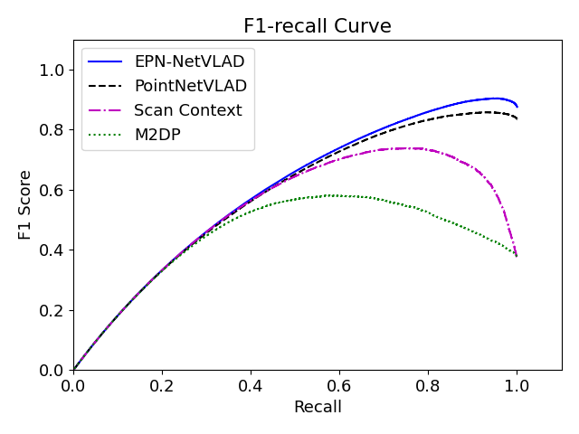

# SE(3)-Equivariant Place Recognition
This repository contains the code (in PyTorch) for **SE(3)-Equivariant Point Cloud-based Place Recognition**.

## Abstract
This paper reports on a new 3D point cloud-based place recognition framework that uses SE(3)-equivariant networks to learn SE(3)-invariant global descriptors. We discover that, unlike existing methods, learned SE(3)-invariant global descriptors are more robust to matching inaccuracy and failure in severe rotation and translation configurations. Mobile robots undergo arbitrary rotational and translational movements. The SE(3)-invariant property ensures the learned descriptors are robust to the rotation and translation changes in the robot pose and can represent the intrinsic geometric information of the scene. Furthermore, we have discovered that the attention module aids in the enhancement of performance while allowing significant downsampling. We evaluate the performance of the proposed framework on real-world data sets. The experimental results show that the proposed framework outperforms state-of-the-art baselines in various metrics, leading to a reliable point cloud-based place recognition network.


## Different Branches
In the paper, we tested both [EPN](https://github.com/nintendops/EPN_PointCloud) and [E2PN](https://github.com/minghanz/EPN_PointCloud) as encoder for learning equivariant features from point clouds. The modules for two encoders are slightly different, to avoid conficts, we separte them into two branches. The master branch contains code for testing EPN, and the e2pn brach contains code for testing E2PN.

For EPN:
```
git checkout master
```
For E2PN:
```
git checkout e2pn
```

## Environment Set Up
The code has been tested on a Ubuntu 20.04 machine equipped with Intel i9-10900K CPU with a 3.7 GHz processor and an Nvidia GeForce RTX 3090. 
The code has been tested with python 3.8.12 and pytorch 1.11.0.
See [docker](docker) folder for how to use docker image and build docker container.
In addition to docker, The module and additional dependencies can be installed with
```
cd vgtk
python setup.py install
```
Note: It might require root access to install the module.

## Experiments

### Datasets
This repository is tested with Oxford Robocar benchmark created by [PointNetVLAD](https://github.com/mikacuy/pointnetvlad), and can be downloaded [here](https://drive.google.com/drive/folders/1Wn1Lvvk0oAkwOUwR0R6apbrekdXAUg7D). 

We create training tuples following [PointNetVLAD](https://github.com/mikacuy/pointnetvlad)'s procedure to generate training and testing tuples in pickle files. The picke files we used for training and testing can be downloaded [here](https://drive.google.com/drive/folders/1ajjKkQ5KQ8eOER-dkhZ2P6fMPtduUGWJ?usp=sharing). Please see [PointNetVLAD's generating_queries folder](https://github.com/mikacuy/pointnetvlad/tree/master/generating_queries) for detail implementation.

### Pretrained Model
Pretrained weights for `epn_netvlad`, `epn_gem`, `atten_epn_netvlad`, `e2pn_netvlad`, and `e2pn_gem` models can be downloaded [here](https://drive.google.com/drive/folders/1xU4nYkXLMiy6x92zr5GGzuQamAzjtbYv?usp=sharing).

### Training
First, change the cofigurations for training settings in [config.py](config.py) file. Especially for variables such as: `DATASET_FOLDER`, `MODEL`, `TRAIN_FILE`, and `TEST_FILE`

After changing the cofigurations, the following command can be used to train the model:

```
python train_oxford.py
```

### Evaluation
First, change the cofigurations for training settings in [config.py](config.py) file. Especially for variables such as: `EVAL_MODEL`, `RESUME_FILENAME`, `EVAL_DATABASE_FILE`, and `EVAL_QUERY_FILE`.
After changing the cofigurations, the following command can be used for the evaluation:

For evaluation on Oxford:
```
python eval_oxford.py
```
For evaluation on KITTI:
```
python eval_kitti.py
```

### Results
Results show the precision-recall curve, f1-recall curve, and average recall at top N curve.




## Reference Code
- [EPN-PointCloud](https://github.com/nintendops/EPN_PointCloud): Equivariant Point Network (EPN). We modified it to be our SE(3)-invariant point cloud local feature extractor in oour framework.
- [PointNetVLAD in Tensorflow](https://github.com/mikacuy/pointnetvlad) and [PointNetVlad-Pytorch](https://github.com/cattaneod/PointNetVlad-Pytorch). We utilized the benchmark_dataset, code for training with quadruplet loss, and place recognition evaluation.